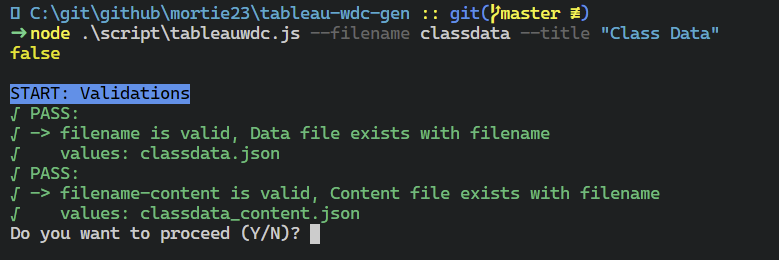
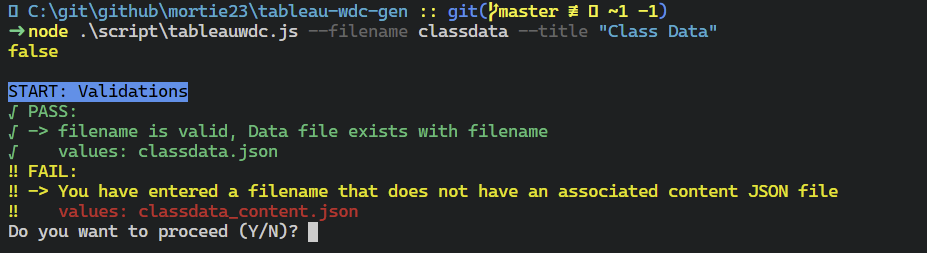

# Tableau Web Data Connectors

Using Tableau Web Data Connector (WDC) as the data source for dashboard.

**Reason**:

1. The data we are sourcing is in SAS.
1. If using Tableau Public the only server sources are Google Sheets and Tableau WDC.
1. Tableau WDC is the easiest way to have a Tableau Public dashboard sourcing from a server that can be updated independantly of the dashboard.

## Background

If you are interested in the details of how this pacakge works it is built from knowledged gained through this tutorial.  
[https://tableau.github.io/webdataconnector/docs/wdc_tutorial.html](https://tableau.github.io/webdataconnector/docs/wdc_tutorial.html)

## Generate the data

To generate the JSON that this package uses we will use the SASjs macro core library. Directly using `proc json` adds a high level array element to the JSON output that we don't want: `['SASTableData+<filename>']`.  
This means that we create a clean JSON output and we would be able to use different tools in the future and not have legacy SAS generated objects.

Documentation on the SASjs `mp_jsonout` macro can be found at: [https://core.sasjs.io/mp\_\_jsonout_8sas.html](https://core.sasjs.io/mp__jsonout_8sas.html)

The key steps are to create two file handles (one for the data, and one for the metadata) and use the SASjs macro to write the files out.

```sas
* Create filename handle for files to write to;
filename json "&outdir./datasourcename.json";
filename jsonmeta "&outdir./datasourcename_meta.json";
* Export to JSON;
%mp_jsonout(OBJ,datasourcename,jref=json)
%mp_jsonout(OBJ,datasourcename_meta,jref=jsonmeta)
```

Full example snippet is here: [sas/generate_json.sas](sas/generate_json.sas).

## Create the WDC

A WDC needs the following 4 files:

| <span></span>                                     | Description                            |
| ------------------------------------------------- | -------------------------------------- |
|  `html`                       | Folder for WDC pages                   |
|  `<filename>.html`         | WDC page                               |
|  `js`                         | Folder for WDC scripts                 |
|  `<filename>.js`             | WDC script                             |
|  `json`                       | Folder for JSON data                   |
|  `<filename>.json`         | The dataset as JSON array              |
|  `<filename>_content.json` | Other text content as name/value pairs |

We will used a `node` script to generate these files from the metadata. To see a description of what the node script does under the hood see [File template changes](#markdown-header-file-template-changes)

### Run the node script

This has been tested on `Node.js 12.19.0 on for Windows 10` run using Powershell.

```ps1
node .\script\tableauwdc.js --filename <filename (no extension)> --title "<a title for the dataset with quotes>" [--geojson]
## example of flat tabular data from SAS
node .\script\tableauwdc.js --filename classdata --title "Class Data"
## example GeoJSON data
node .\script\tableauwdc.js --filename geo_earthquake_4.5_week --title "Geo Earthquake 4.5 week" --geojson
```

You should see a quick summary of some validations and a prompt to continue.  


Do not continue if your validation fails.  


When you pass the validations, then continue, your WDC should be built.
